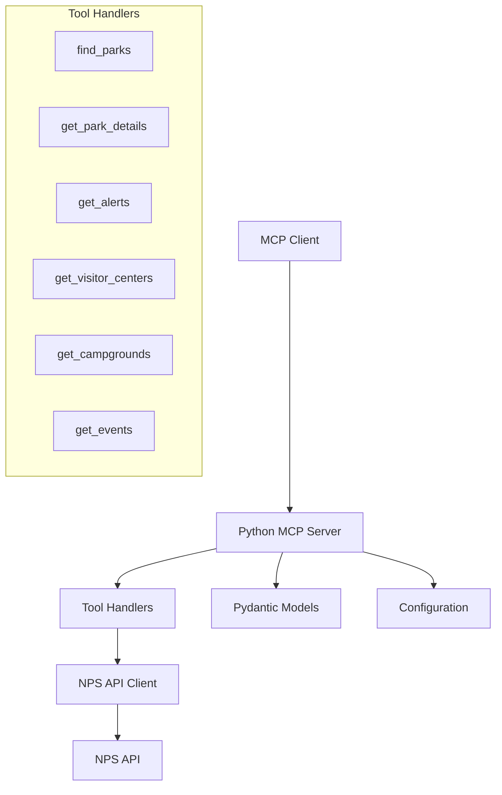

# Design Document

## Overview

This design outlines the conversion of the existing TypeScript/Node.js National Parks MCP server to a private Python implementation. The new Python server will maintain full functional compatibility while leveraging modern Python libraries and best practices for improved maintainability and development experience.

The conversion will use the official Python MCP SDK (FastMCP), HTTPX for HTTP client operations, Pydantic for data validation, and Poetry for dependency management. The architecture will follow Python conventions while preserving the existing tool interfaces and functionality.

## Architecture

### High-Level Architecture



### Component Architecture

The Python server will follow a modular architecture with clear separation of concerns:

1. **Server Layer**: FastMCP server handling MCP protocol and tool registration
2. **Handler Layer**: Individual tool implementations with input validation
3. **API Client Layer**: HTTPX-based client for NPS API interactions
4. **Data Layer**: Pydantic models for type safety and validation
5. **Configuration Layer**: Environment-based configuration management

## Components and Interfaces

### MCP Server Component

**File**: `src/server.py`

The main server component will use FastMCP for MCP protocol handling:

```python
from mcp.server.fastmcp import FastMCP
from typing import Dict, Any

class NationalParksServer:
    def __init__(self):
        self.mcp = FastMCP("National Parks", json_response=True)
        self._register_tools()

    def _register_tools(self):
        # Register all tool handlers
        pass

    def run(self):
        self.mcp.run(transport="stdio")
```

### Tool Handler Interface

**Pattern**: Each tool will be implemented as a decorated function with Pydantic validation:

```python
from pydantic import BaseModel
from typing import Optional, List

class FindParksRequest(BaseModel):
    state_code: Optional[str] = None
    activity_id: Optional[str] = None
    query: Optional[str] = None
    limit: int = 10

@mcp.tool()
def find_parks(request: FindParksRequest) -> Dict[str, Any]:
    """Search for national parks by state, activity, or keyword"""
    # Implementation
    pass
```

### API Client Component

**File**: `src/api_client.py`

The API client will use HTTPX for modern async/sync HTTP operations:

```python
import httpx
from typing import Dict, Any, Optional
from pydantic import BaseModel

class NPSAPIClient:
    def __init__(self, api_key: str, base_url: str = "https://developer.nps.gov/api/v1"):
        self.api_key = api_key
        self.base_url = base_url
        self.client = httpx.Client(
            headers={"X-Api-Key": api_key},
            timeout=30.0
        )

    def get_parks(self, **params) -> Dict[str, Any]:
        # Implementation with error handling and rate limiting
        pass
```

### Configuration Management

**File**: `src/config.py`

Environment-based configuration using Pydantic settings:

```python
from pydantic_settings import BaseSettings
from typing import Optional

class Settings(BaseSettings):
    nps_api_key: Optional[str] = None
    nps_api_base_url: str = "https://developer.nps.gov/api/v1"
    log_level: str = "INFO"

    class Config:
        env_file = ".env"
        env_file_encoding = "utf-8"
```

## Data Models

### Pydantic Models for Validation

All tool inputs and API responses will use Pydantic models for type safety:

```python
from pydantic import BaseModel, Field
from typing import List, Optional, Dict, Any
from datetime import datetime

# Tool Input Models
class FindParksRequest(BaseModel):
    state_code: Optional[str] = Field(None, description="Two-letter state code")
    activity_id: Optional[str] = Field(None, description="Activity ID to filter by")
    query: Optional[str] = Field(None, description="Search query")
    limit: int = Field(10, ge=1, le=50, description="Number of results to return")

class GetParkDetailsRequest(BaseModel):
    park_code: str = Field(..., description="Four-letter park code")

# API Response Models
class ParkData(BaseModel):
    id: str
    url: str
    fullName: str
    parkCode: str
    description: str
    latitude: str
    longitude: str
    latLong: str
    states: str
    contacts: Dict[str, Any]
    entranceFees: List[Dict[str, Any]]
    entrancePasses: List[Dict[str, Any]]
    fees: List[Dict[str, Any]]
    directionsInfo: str
    directionsUrl: str
    operatingHours: List[Dict[str, Any]]
    addresses: List[Dict[str, Any]]
    images: List[Dict[str, Any]]
    weatherInfo: str
    name: str
    designation: str

class NPSResponse(BaseModel):
    total: str
    limit: str
    start: str
    data: List[ParkData]
```

### Error Response Models

Standardized error responses for consistent error handling:

```python
class ErrorResponse(BaseModel):
    error: str
    message: str
    details: Optional[Dict[str, Any]] = None

class ValidationErrorResponse(BaseModel):
    error: str = "validation_error"
    message: str
    validation_errors: List[Dict[str, Any]]
```

## Correctness Properties

*A property is a characteristic or behavior that should hold true across all valid executions of a system-essentially, a formal statement about what the system should do. Properties serve as the bridge between human-readable specifications and machine-verifiable correctness guarantees.*

Before writing the correctness properties, I need to analyze the acceptance criteria from the requirements document to determine which ones are testable as properties.

Based on the prework analysis, I'll now convert the testable acceptance criteria into correctness properties:

### Property 1: Functional Equivalence with TypeScript Implementation
*For any* valid tool input that was supported by the TypeScript server, the Python server should return functionally equivalent data structures and handle errors in the same manner
**Validates: Requirements 1.2, 1.3, 1.4**

### Property 2: MCP Protocol Compliance
*For any* valid MCP protocol message, the Python server should handle it according to the MCP specification and provide proper JSON Schema definitions for all tool inputs
**Validates: Requirements 2.4, 2.5**

### Property 3: API Client Correctness
*For any* NPS API request, the API client should include proper authentication headers, respect rate limiting constraints, and handle errors gracefully with structured responses
**Validates: Requirements 3.2, 3.3, 3.4**

### Property 4: Input Validation Consistency
*For any* tool input (valid or invalid), the Python server should validate it before processing and return clear, structured error messages for validation failures
**Validates: Requirements 4.2, 4.4, 4.5**

### Property 5: NPS API Integration Consistency
*For any* NPS API integration pattern used in the TypeScript version, the Python server should maintain the same integration behavior and rate limiting
**Validates: Requirements 1.5**

## Error Handling

### Error Classification

The Python server will implement a comprehensive error handling system with the following error categories:

1. **Validation Errors**: Input validation failures with detailed field-level errors
2. **API Errors**: NPS API communication failures with appropriate retry logic
3. **Authentication Errors**: Missing or invalid API key scenarios
4. **Rate Limiting Errors**: API rate limit exceeded scenarios
5. **Network Errors**: Connection timeouts and network failures
6. **Server Errors**: Internal server errors with proper logging

### Error Response Format

All errors will follow a consistent JSON structure:

```python
{
    "error": "error_type",
    "message": "Human-readable error message",
    "details": {
        "field_errors": [...],  # For validation errors
        "retry_after": 60,      # For rate limiting errors
        "status_code": 429      # For API errors
    }
}
```

### Error Handling Strategy

1. **Graceful Degradation**: Server continues operating even with API failures
2. **Structured Logging**: All errors logged with context for debugging
3. **User-Friendly Messages**: Clear error messages for end users
4. **Retry Logic**: Automatic retries for transient failures
5. **Circuit Breaker**: Prevent cascading failures during API outages

## Testing Strategy

### Dual Testing Approach

The Python server will implement both unit testing and property-based testing for comprehensive coverage:

**Unit Tests**:
- Specific examples demonstrating correct behavior
- Edge cases and error conditions
- Integration points between components
- Mock-based testing for external API interactions

**Property-Based Tests**:
- Universal properties that hold for all inputs
- Comprehensive input coverage through randomization
- Minimum 100 iterations per property test
- Each property test references its design document property

### Property-Based Testing Configuration

The testing strategy will use Hypothesis for property-based testing:

```python
from hypothesis import given, strategies as st
import pytest

@given(st.text(), st.integers(min_value=1, max_value=50))
def test_find_parks_property(query, limit):
    """
    Feature: python-mcp-server, Property 1: Functional Equivalence with TypeScript Implementation
    """
    # Test implementation
    pass
```

### Testing Framework Selection

- **Unit Testing**: pytest for test discovery and execution
- **Property-Based Testing**: Hypothesis for generating test inputs
- **Mocking**: pytest-mock for external API mocking
- **Coverage**: pytest-cov for code coverage reporting
- **API Testing**: httpx for testing HTTP client behavior

### Test Organization

```
tests/
├── unit/
│   ├── test_handlers/
│   │   ├── test_find_parks.py
│   │   ├── test_get_park_details.py
│   │   └── ...
│   ├── test_api_client.py
│   ├── test_config.py
│   └── test_server.py
├── integration/
│   ├── test_nps_api_integration.py
│   └── test_mcp_protocol.py
├── property/
│   ├── test_functional_equivalence.py
│   ├── test_validation_consistency.py
│   └── test_api_client_correctness.py
└── conftest.py
```

### Test Data Management

- **Fixtures**: Reusable test data and mock responses
- **Factories**: Dynamic test data generation using factory_boy
- **Snapshots**: Golden master testing for complex response validation
- **Environment**: Separate test configuration and API keys

## Implementation Plan

### Phase 1: Core Infrastructure
1. Set up Python project structure with Poetry
2. Implement FastMCP server foundation
3. Create Pydantic models for all data structures
4. Set up configuration management

### Phase 2: API Client Implementation
1. Implement HTTPX-based NPS API client
2. Add authentication and rate limiting
3. Create comprehensive error handling
4. Add logging and monitoring

### Phase 3: Tool Handler Implementation
1. Implement all six tool handlers
2. Add input validation using Pydantic
3. Integrate with API client
4. Add response formatting

### Phase 4: Testing and Validation
1. Implement unit tests for all components
2. Add property-based tests for correctness properties
3. Create integration tests with NPS API
4. Add performance and load testing

### Phase 5: Documentation and Distribution
1. Create comprehensive documentation
2. Add usage examples and tutorials
3. Set up private package distribution
4. Create deployment guides

## Dependencies

### Production Dependencies

```toml
[tool.poetry.dependencies]
python = "^3.8"
mcp = "^1.0.0"  # Official Python MCP SDK
httpx = "^0.27.0"  # Modern HTTP client
pydantic = "^2.0.0"  # Data validation and settings
pydantic-settings = "^2.0.0"  # Settings management
python-dotenv = "^1.0.0"  # Environment variable loading
structlog = "^23.0.0"  # Structured logging
```

### Development Dependencies

```toml
[tool.poetry.group.dev.dependencies]
pytest = "^7.0.0"
pytest-cov = "^4.0.0"
pytest-mock = "^3.0.0"
hypothesis = "^6.0.0"
black = "^23.0.0"
flake8 = "^6.0.0"
mypy = "^1.0.0"
isort = "^5.0.0"
pre-commit = "^3.0.0"
```

## Project Structure

```
src/
├── __init__.py
├── main.py                 # Entry point
├── server.py              # FastMCP server setup
├── config.py              # Configuration management
├── models/                # Pydantic data models
│   ├── __init__.py
│   ├── requests.py        # Tool input models
│   ├── responses.py       # API response models
│   └── errors.py          # Error models
├── handlers/              # Tool implementations
│   ├── __init__.py
│   ├── find_parks.py
│   ├── get_park_details.py
│   ├── get_alerts.py
│   ├── get_visitor_centers.py
│   ├── get_campgrounds.py
│   └── get_events.py
├── api/                   # NPS API client
│   ├── __init__.py
│   ├── client.py          # HTTPX client
│   ├── auth.py            # Authentication
│   └── rate_limit.py      # Rate limiting
└── utils/                 # Utility functions
    ├── __init__.py
    ├── logging.py         # Logging setup
    └── formatters.py      # Data formatters
```
